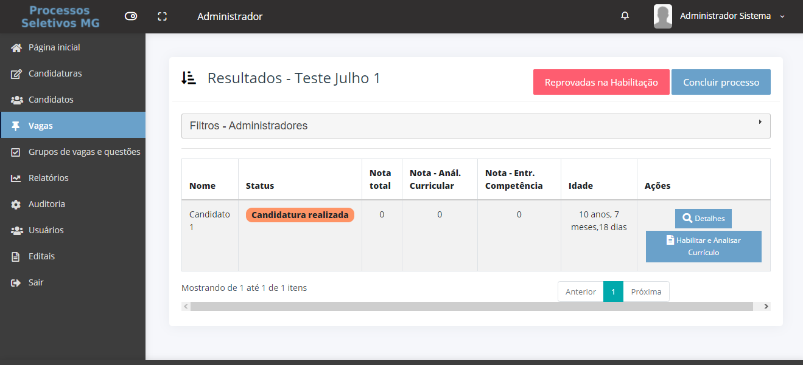

# Habilitação de candidatura

Para a fase de habilitação, o formulário utilizado para análise será o mesmo da avaliação de currículo, podendo as duas fases serem feitas em sequência, caso a candidatura esteja adequada aos requisitos da vaga.&#x20;

Para começar, clique no menu “Vagas” e então no botão “Resultados da vaga”.

.png>)

Na tela a seguir será exibida a lista de candidaturas concluídas para a vaga selecionada. Para encontrar uma determinada candidatura, digite o nome do candidato na barra de pesquisa ou o status desejado e clique em “Filtrar”. Para iniciar a avaliação e habilitação do candidato, clique no botão “Analisar currículo”

Nesta tela o avaliador tem acesso a todas as informações e documentos enviados pelo candidato durante sua inscrição para a vaga. Se desejar, o avaliador tem a opção de esconder o menu da esquerda para aumentar o espaço da tela do formulário ao clicar no botão ao lado do logo Processos Seletivos MG

.png>)

Basta navegar pelas opções do segundo menu para alternar para os diversos segmentos de informação da candidatura.&#x20;

No topo se encontra a opção “Avaliação” que retorna para o formulário de avaliação e habilitação. Verifique as informações de acordo com os requisitos do edital.&#x20;


Para visualizar os documentos dos candidatos, caso estejam disponíveis, basta clicar no botão azul com o nome do documento e ele será baixado para o seu computador.


**Casos possíveis:**&#x20;

**1. Candidato Habilitado:** Se o candidato for declarado habilitado, prosseguir para o tópico [Avaliação de currículo.](avaliacao-de-curriculo.md)&#x20;

**2. Candidato Reprovado na Habilitação:** Se o candidato for declarado inapto na fase de habilitação, o avaliador deverá sinalizar no sistema essa reprovação parcial.&#x20;


Ao reprovar, deixe todos os campos de avaliação vazios.


Para tanto, clique no botão “Reprovar” no formulário de avaliação.

.png>)

.png>)
